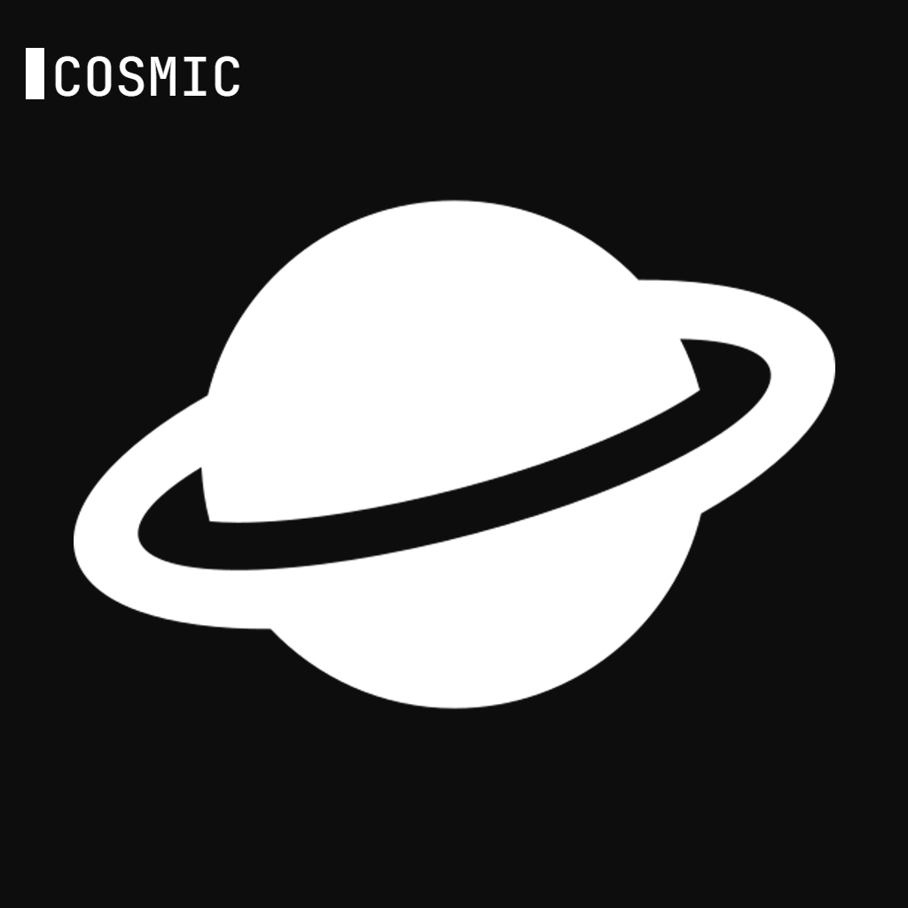

# What is Cosmic?
## Cosmic is an open source and free to use informational and utility focused Discord Bot. It is themed around Space and most of the commands are space related as well.
<p align="center">
  
</p>

# Self-hosting
- Clone the repository.
- Create a new virtual environment using [venv](https://docs.python.org/3/library/venv.html).
- Active the virtual environment and type the following command:
```bash
pip install -r requirements.txt
```
- Create a `.env` file and then put these two variables: `DISCORD_API_TOKEN` & `BING_MAP_API_KEY`. You can get your own Bing Map Key from [Bing Map Portal](https://www.bingmapsportal.com/).
- Please note, `keep_alive.py` only exists so that you can host the 24/7 app using [Repl.it](https://replit.com) & [UptimeRobot](https://uptimerobot.com). By default, it is commented out in `main.py`.

# License
The project is licensed under the MIT license.